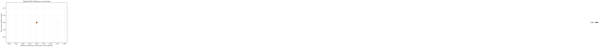

# Final Report: Finger Counting Imaging Classification

**Team Members:** Sichao Qiu, Yuexin Wang, Yeyan Wang
**Course:** ISYE 6740 - Computational Data Analysis (Spring 2026)

---

## 1. Problem Statement
In computer vision, image classifiers often achieve high accuracy under controlled conditions- such as monochrome backgrounds and uniform lighting. However, their performance degrades in real-world scenarios characterized by cluttered backgrounds, varying illumination, also when the finger gestures have some obstructions or taking from complex angles. 

This project aims to bridge this gap by building a robust finger counting model. By progressing from a baseline model, this system will be capable of accurately recognizing finger gestures from 0 to 5 while accounting for:
1. **Environmental Noise:** Cluttered backgrounds and inconsistent lighting.
2. **Perspective Variance:** Gestures captured from various angles.
3. **Individual Diversity:** Variations in hand shapes and sizes across different users.
4. **Interactive Application:** Integration of the finger-count model into real-time environments, such as Rock-Paper-Scissors game, to evaluate robustness, usability, and reliability under dynamic, real-world conditions. 

---

## 2. Research Questions
1. To what extent does the cascaded PCA+LDA architecture improve class separability in the feature space compared to standard PCA?
2. How does a hybrid approach that integrates local gradient-based structural descriptors with global dimensionality reduction (HOG + PCA) compare to traditional pixel-level projections (PCA, PCA+LDA) in terms of classification accuracy and computational robustness for multi-pose finger gestures?
3. What is the measurable "Robustness Decay" when moving from monochrome to cluttered backgrounds?
4. Can manifold learning methods such as ISOMAP or UMAP handle complex backgrounds better than linear PCA to prevent this robustness decay?
5. How does the model maintain robustness and reliability when applied to a subset of gestures used in games (0, 2, 5) compared to the full range of finger-count classes? 

---

## 3. Data Source & Preprocessing
### 3.1 Data Source
* **Dataset 1 (Ideal):** Finger Digits 0-5. 12,000 thresholded images with isolated hand gestures against black backgrounds.
* **Dataset 2 (Stressed):** Counting Fingers Dataset. Gestures captured in natural environments with significant background clutter and inconsistent lighting.

### 3.2 Preprocessing
As executed by our data pipeline script, all datasets undergo a strict, automated preparation process before feature extraction:
* **Resizing & Flattening:** All images are uniformly reshaped to 64x64 pixels and flattened into 4096-dimensional vectors for linear processing.
* **Normalization:** Standardized pixel-level scaling is applied to ensure mathematical stability across all features.
* **Class Balancing:** The training set undergoes automated class balancing to prevent bias toward overrepresented hand gestures.
* **Targeted Downsampling (Game Subset):** Specifically for the interactive game deployment, the filtered classes (0, 2, and 5) are downsampled to a maximum of 300 samples per class (`MAX_PER_CLASS = 300`) to ensure a perfectly balanced strategic simulation.

---

## 4. Methodology
The execution of this project is orchestrated through a progressive, three-module Python pipeline:

1. **Module 1: Ideal Baseline:** Evaluates foundational feature extractors (PCA, PCA+LDA, and HOG+PCA) on the isolated gesture dataset. Each model is trained using a K-NN classifier and optimized via 5-Fold Cross-Validation to establish an accuracy ceiling.
2. **Module 2: Robustness Tournament:** Transitions to the complex "Stressed" dataset. It automatically evaluates both linear (PCA, LDA, HOG) and non-linear (ISOMAP, UMAP) dimensionality reduction techniques. The algorithm actively calculates robustness decay and crowns the "Most Robust Feature Extractor" based on the highest stressed accuracy.
3. **Module 3: Strategic Deployment (RPS Game):** Takes the winning feature extractor from the tournament and applies it to the Rock-Paper-Scissors data subset. It performs a final, dynamic classifier selection by comparing K-NN and SVM capabilities. The optimal configuration is then deployed into a simulated 10-round RPS game to evaluate real-time interactive performance.

---

## 5. Result and Analysis

### 5.1 Module 1: Foundational Modeling under Ideal Conditions

### 5.2 Module 2: Robustness Evaluation under Complex Environments

**Objective:**
The focus of Module 2 is the "Robustness Tournament." We evaluated how environmental complexity affects classification performance by measuring "Robustness Decay"—the percentage drop in accuracy when moving from the ideal dataset to the stressed dataset.

**Experimental Performance (Stressed Dataset):**
*Training Samples: 78 | Test Samples: 17*

| Feature Extractor | Stressed Accuracy | Ideal Accuracy | Robustness Decay |
| :--- | :---: | :---: | :---: |
| **LDA** | **0.8824** | **1.0000** | **11.76%** |
| HOG + PCA | 0.8824 | 1.0000 | 11.76% |
| PCA | 0.7647 | 1.0000 | 23.53% |
| ISOMAP | 0.7647 | 1.0000 | 23.53% |
| UMAP | 0.5882 | 1.0000 | 41.18% |

**Discussion of Robustness Analysis:**
* **Linear vs. Non-linear Resilience:** Surprisingly, non-linear manifold learning (**ISOMAP**) performed identically to linear **PCA** (0.7647). **UMAP** suffered the highest decay (41.18%), suggesting that for low-sample noisy environments, complex non-linear projections may overfit background noise.
* **Structural Descriptors:** The **HOG + PCA** pipeline demonstrated high resilience (0.8824). Gradient-based structural descriptors effectively isolated gesture geometry from pixel-level background fluctuations.
* **Supervised Feature Extraction:** **LDA** tied for the highest accuracy. By maximizing inter-class separability, LDA successfully filtered out environmental stress that unsupervised methods (PCA) failed to ignore.

**Conclusion:** **LDA** was selected as the most robust feature extractor for the interactive application in Module 3.

### 5.3 Module 3: Rock-Paper-Scissors (Strategic Application)

---

## 6. Conclusion

---

## 7. References
1. Zhang, D., Zhao, X., Han, J., & Zhao, Y. (2014). A comparative study on PCA and LDA based EMG pattern recognition for anthropomorphic robotic hand. 2014 IEEE International Conference on Robotics and Automation (ICRA), 4850-4855.
2. Lai, C. Q., & Teoh, S. S. (2016). An Efficient Method of HOG Feature Extraction Using Selective Histogram Bin and PCA Feature Reduction. Advances in Electrical and Computer Engineering, 16(4), 101-108.
3. Ahmed, F., Khan, W. A., Iqbal, M., Abazeed, A. R. A., Alrababah, H., & Khan, M. F. (2023). Rock-paper-scissors image classification using transfer learning. 2023 International Conference on Business Analytics for Technology and Security (ICBATS), 1-6.
4. Reza, A. M. (2004). Realization of the Contrast Limited Adaptive Histogram Equalization (CLAHE) for Real-Time Image Enhancement. Journal of VLSI Signal Processing Systems, 38, 35-44.
