# Final Report: Finger Counting Imaging Classification

**Team Members:** Sichao Qiu, Yuexin Wang, Yeyan Wang  
**Course:** ISYE 6740 - Computational Data Analysis (Spring 2026)

---

## 1. Problem Statement
In computer vision, image classifiers often achieve high accuracy under controlled conditions- such as monochrome backgrounds and uniform lighting. However, their performance degrades in real-world scenarios characterized by cluttered backgrounds, varying illumination, also when the finger gestures have some obstructions or taking from complex angles. 

This project aims to bridge this gap by building a robust finger counting model. By progressing from a baseline model, this system will be capable of accurately recognizing finger gestures from 0 to 5 while accounting for:
- **Environmental Noise:** Cluttered backgrounds and inconsistent lighting.
- **Perspective Variance:** Gestures captured from various angles.
- **Individual Diversity:** Variations in hand shapes and sizes across different users.
- **Interactive Application:** Integration of the finger-count model into real-time environments, such as Rock-Paper-Scissors game, to evaluate robustness, usability, and reliability under dynamic, real-world conditions.

While contemporay "black-box" frameworks provide high end-to-end accuracy and robust computational results, for instances, the MediaPipe framework achieves a mean precision of 95.7% in palm identification by utilizing a coordinated machine learning pipeline to infer 3D landmarks (Roy et al., 2022) Similarly, Convolutional Neural Networks (CNN) and models like YOLOv3 are used to learn features and classify gestures directly from video frames, achieving accuracies as high as 97.68%. Futhermore, by using Skeletal and 3D Modeling can improve the detection of complex features, such as track the skeletal joints of the hand (such as 20 or 25 joints) as well as their trajectories, curvatures and angles(Oudah et al., 2020) However, their logic for a specific prediction is hidden within millions of parameters, they often obscure the relationship between raw pixel variance and environmental stressor, we want to quantify how specific real-world scenarios would degrade the underlying feature space in our project.

Therefore, our methodology is not merely a classification task but a comparative study on feature robustness, aiming to quantify the transition from raw intensity data to structural descriptors. We deliberately employs a suite of interpretable algorithms: PCA, LDA, HOG, and UMAP, to deconstruct the mechanics of hand gesture recognition.

---

## 2. Research Questions
1. To what extent does the cascaded PCA+LDA architecture improve class separability in the feature space compared to standard PCA?
2. How does a hybrid approach that integrates local gradient-based structural descriptors with global dimensionality reduction (HOG + PCA) compare to traditional pixel-level projections (PCA, PCA+LDA) in terms of classification accuracy and computational robustness for multi-pose finger gestures?
3. What is the measurable "Robustness Decay" when moving from monochrome to cluttered backgrounds?
4. Can manifold learning methods such as ISOMAP or UMAP handle complex backgrounds better than linear PCA to prevent this robustness decay?
5. How does the model maintain robustness and reliability when applied to a subset of gestures used in games (0, 2, 5) compared to the full range of finger-count classes? 

---

## 3. Data Source & Preprocessing

### 3.1 Data Source
* **Dataset 1 (Ideal):** [Finger Digits 0-5](https://www.kaggle.com/datasets/roshea6/finger-digits-05). 12,000 thresholded images with isolated hand gestures against black backgrounds.

  
  <strong><em>Figure 1: Sample Images for Dataset 1</em></strong>

 

* **Dataset 2 (Stressed):** [Counting Fingers Dataset](https://www.kaggle.com/datasets/piyushjoshi01/counting-fingers-dataset). Gestures captured in natural environments with significant background clutter and inconsistent lighting.

  
  <strong><em>Figure 2: Sample Images for Dataset 2</em></strong>

 

* **Dataset 3 (Game):** [Fingers Dataset](https://www.kaggle.com/datasets/koryakinp/fingers). This dataset contains hand gesture images spanning classes 0–5, and will serve as unseen data for evaluating our Rock-Paper-Scissors game simulation in Module 3.

  
  <strong><em>Figure 3: Sample Images for Dataset 3</em></strong>

 

### 3.2 Preprocessing and Standardization
To ensure mathematical stability and prevent bias, the preprocessing and standardization steps are excecuted before model processing.
* **Resizing & Flattening:** Each 2D image $\mathbf{I}$ is resized to $64 \times 64$ pixels. The resized matrix $\mathbf{I} \in \mathbb{R}^{64 \times 64}$ are then flattened into 4096-dimensional vectors $\mathbf{x} \in \mathbb{R}^d$ for linear processing.
* **Normalization:** Pixel-level Z-score standardization is applied to ensure scale uniformity across all features:
  $$\mathbf{x}_{std} = \frac{\mathbf{x} - \mu}{\sigma + \epsilon}$$
  Where $\mu$ and $\sigma$ are the mean and standard deviation of the image pixels, and $\epsilon = 1e^{-7}$ is a small constant (epsilon) added to prevent division by zero.
* **Class Balancing:** The training set undergoes automated class augmentation to ensure an equal sample distribution, preventing downstream classifiers from biasing toward majority gestures.
* **Environmental Mitigation (Dataset 2 Only):** For the Stressed dataset, Gaussian smoothing is applied to reduce high-frequency noise: $$G(x, y) = \frac{1}{2\pi\sigma^2} e^{-\frac{x^2+y^2}{2\sigma^2}}$$ This convolution smooths the image, allowing the model to focus on the primary structural contours of the hand. Then followed by Contrast Limited Adaptive Histogram Equalization (CLAHE) to mitigate uneven lighting.

---

## 4. Methodology
The project is structured into three progressive modules to evaluate and enhance model performance. 

### 4.1 Module 1: Foundational Modeling (`run_module_1()`)
This module establishes a baseline performance ceiling by evaluating foundational feature extractors on the noise-free, Ideal dataset. 

- Feature Engineering & Dimensionality Reduction
  
1. Principal Component Analysis (**PCA**):
    We implement Principal Component Analysis (PCA) as a baseline for global feature extraction. we reduce the 4096-dimensional pixel space into a lower-dimensional subspace while retaining 95% of the variance.
     - Covariance Matrix: $\mathbf{C} = \frac{1}{n-1} \sum_{i=1}^{n} (\mathbf{x}_i - \bar{\mathbf{x}})(\mathbf{x}_i - \bar{\mathbf{x}})^T$.
     - Eigen-Decomposition: Solving $\mathbf{C}\mathbf{v} = \lambda \mathbf{v}$.
     - Selection: We retain components satisfying  $\frac{\sum_{i=1}^{k} \lambda_i}{\sum_{j=1}^{d} \lambda_j} \geq 0.95 $.
        
2. Supervised Linear Projection (**PCA+LDA**): Building on the comparative study of robotic hand control by (Zhang et al., 2014), this framework integrates PCA and Linear Discriminant Analysis (LDA). LDA maximizes class separability by solving for the weight vector $w$ that maximizes the Fisher criterion:

$$
J(w) = \frac{w^T S_B w}{w^T S_W w}
$$

&nbsp;&nbsp;&nbsp;&nbsp;Where $S_B$ represents between-class scatter and $S_W$ represents within-class scatter.

3. Structural Gradient Descriptors (**HOG+PCA**): Drawing on the research of (Lai & Teoh, 2016), HOG captures local shape by calculating the gradient magnitude and orientation $\theta$, then applied PCA to refine the high-dimensional HOG vectors into a manageable feature set:
  
$$
Magnitude = \sqrt{G_x^2 + G_y^2}, \quad \theta = \arctan\left(\frac{G_y}{G_x}\right)
$$
  
&nbsp;&nbsp;&nbsp;&nbsp;These are binned into histograms within $8 \times 8$ cells and normalized across $2 \times 2$ blocks to ensure local contrast invariance.

- Automated Hyperparameter Tuning (Grid Search):
  * Distance: Euclidean distance $L_2 = \|\mathbf{z}_i - \mathbf{z}_q\|_2$.
  * Optimal K: Determined via GridSearchCV ($K \in [1, 30]$) with 5-fold cross-validation.
  * Robustness Floor: We enforce $K_{final} = \max(K_{opt}, 5)$ to ensure a minimum neighborhood consensus, protecting the model from localized pixel noise in the Stressed dataset.

### 4.2 Module 2: Robustness Evaluation (`run_module_2()`)
This module aims to measure how different models (linear methods in Module 1 versus non-linear Manifold Learning methods) affects the "Robustness Tournament". We evaluate the resilience of feature extraction pipelines against environmental noise, background clutter, and varying illumination.

- Non-linear Manifold Learning:

1. Isometric Mapping (**ISOMAP**): 
   Introduced by (Tenenbaum et al., 2000), ISOMAP is implemented to capture the non-linear geometric structure of hand gestures by preserving geodesic distances.
   - Neighborhood Graph: Constructs an adjacency graph $G$ where each point $\mathbf{x}_i$ is connected to its $k$-nearest neighbors.
   - Geodesic Distance: Approximates the distance along the manifold surface using the shortest path algorithm: $d_G(i, j) = \min(path_{i \to j})$.
   - Embedding: Applies MDS to the resulting geodesic distance matrix to find low-dimensional coordinates $\mathbf{y}_i$.

2. Uniform Manifold Approximation and Projection (**UMAP**): 
   Introduced by (McInnes et al., 2018), UMAP is utilized to explore topological connectivity. It assumes the data is uniformly distributed on a locally connected Riemannian manifold.
   - Fuzzy Simplicial Set: Constructs a high-dimensional fuzzy topological representation of the data.
   - Layout Optimization: Minimizes the cross-entropy between the high-dimensional and low-dimensional representations to preserve both local and global structures:
   
$$
CE(P, Q) = \sum_{a \in A} \left( \mu(a) \log \frac{\mu(a)}{\nu(a)} + (1 - \mu(a)) \log \frac{1 - \mu(a)}{1 - \nu(a)} \right)
$$

&nbsp;&nbsp;&nbsp;&nbsp;Where $\mu$ and $\nu$ represent the membership strengths in the high and low-dimensional graphs, respectively.

- Resilience Assessment & Tournament Logic:

* Robustness Decay: We quantify the sensitivity of each pipeline to environmental stress by calculating the percentage drop in accuracy from the Ideal to the Stressed dataset:
  
$$
Robustness Decay = \frac{Accuracy_{Ideal} - Accuracy_{Stressed}}{Accuracy_{Ideal}} \times 100\%
$$

* Tournament Mechanism: The pipeline automatically iterates through all linear and non-linear extractors, ranking them based on their "Resilience Score" (minimum decay) to identify the optimal model for real-time deployment.

### 4.3 Module 3: Rock-Paper-Scissors Application (`run_module_3()`)
We translate our experimental findings into a strategic deployment.
* **Data Subsetting & Downsampling:** The dataset is filtered to include only Rock (0), Scissors (2), and Paper (5). To ensure a perfectly balanced simulation, these classes are strictly downsampled to a maximum of 500 samples per class (`MAX_PER_CLASS = 500`).
* **Classifier Showdown:** Inheriting the winning feature extractor from Module 2, we initiate a final comparison between **K-NN** and a Support Vector Machine (**SVM**) using an RBF kernel. 
* **Game Simulation:** The winning classifier is deployed into a 10-round RPS simulation. Game outcomes (Win/Lose/Tie) are determined by comparing the model's predicted gesture against a randomly sampled computer move, with representative outcome examples visualized for analysis.
---

## 5. Result and Analysis

### 5.1 Module 1: Foundational Modeling under Ideal Conditions
The primary objective of Module 1 is to establish a performance "ceiling" under controlled conditions, characterized by uniform backgrounds and consistent lighting. By evaluating the Ideal dataset, we validate the integrity of the feature extraction pipeline and the classification logic before introducing environmental complexity.
#### 5.1.1 Dimensionality Reduction and Variance Analysis (PCA)
The initial 4096-dimensional pixel space ($64 \times 64$ grayscale) was processed using Principal Component Analysis (PCA) to evaluate data redundancy.

  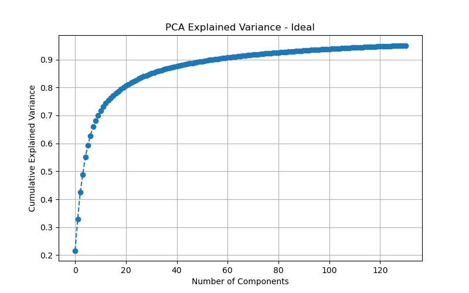 
  <strong><em>Figure4: PCA Variance - Ideal</em></strong>

 

Variance Retention: As illustrated in `Figure4: PCA Variance - Ideal`, the dataset exhibits significant energy concentration. The first 20 principal components account for approximately 80% of the variance, while reaching the 95% threshold requires roughly 131 components.

#### 5.1.2 Hyperparameter Optimization (K-NN Tuning)
To ensure a robust classification boundary, we utilized `GridSearchCV` to perform 5-fold cross-validation on the number of neighbors ($K$) for all feature sets.
  - Tuning Performance across PCA, LDA, and HOG:

  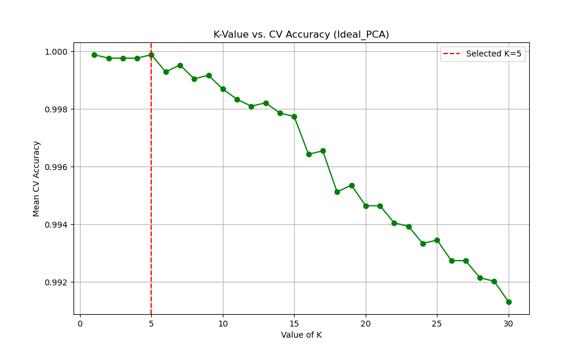 
  <strong><em>Figure5: KNN Tuning - Ideal PCA</em></strong>

 

  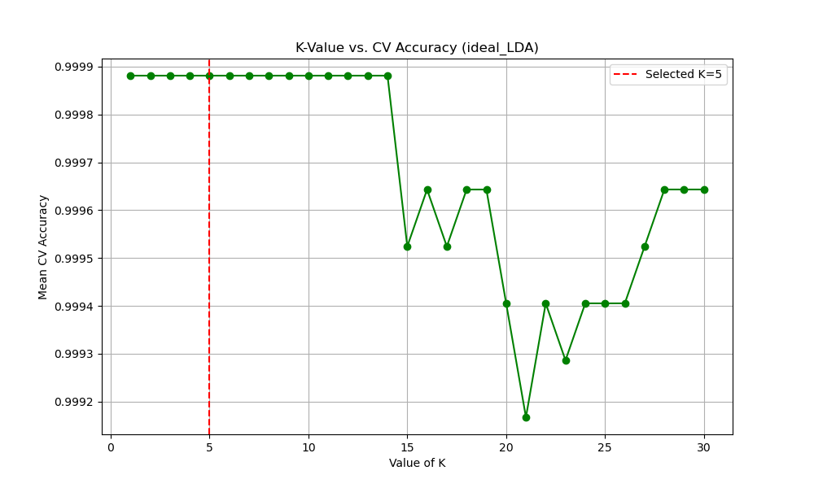 
  <strong><em>Figure6: KNN Tuning - Ideal LDA</em></strong>

 

According to `Figure5: KNN Tuning - Ideal PCA` and `Figure6: KNN Tuning - Ideal LDA`, the Mean CV Accuracy for pixel-based methods remains remarkably stable at 1.0000 for nearly all tested $K$ values.

  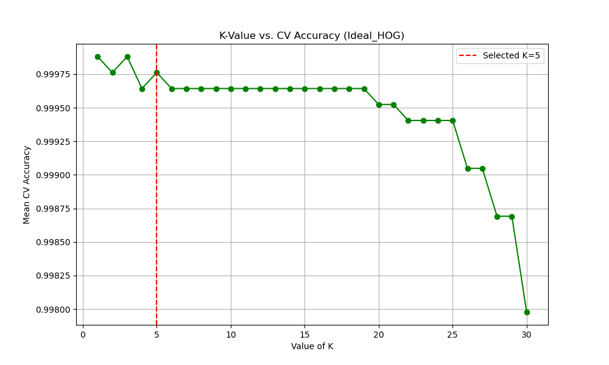 
  <strong><em>Figure7: KNN Tuning - Ideal HOG</em></strong>

 

For the gradient-based method,`Figure7: KNN Tuning - Ideal HOG` also demonstrates a high-performance plateau, with the accuracy holding steady at ~0.9998. This indicates that HOG features are just as discriminative as raw pixels in noise-free environments.

- The Robustness Constraint: Across all three feature strategies, because our dataset are too ideal, when $K=1$ , mathematically the model can achieve peak performance, then the threshold with `min_k=5` has been forcibly enabled. This strategic decision ensures that the decision boundaries are supported by a local consensus of neighbors, preventing the model from becoming overly sensitive to minor pixel-level shifts. The selected $K=5$ (marked by the red dashed line in all tuning plots) provides a conservative but reliable baseline.
    

#### 5.1.3 Performance Benchmark Summary

  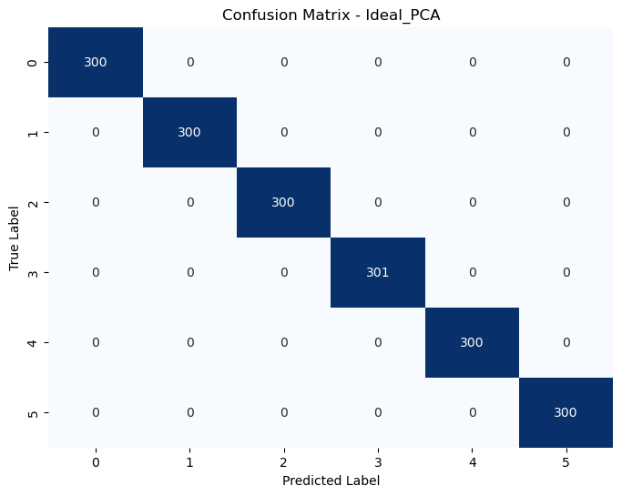 
  <strong><em>Figure8: Confusion Matrix - Ideal PCA</em></strong>

### 5.2 Module 2: Robustness Evaluation under Complex Environments

**Objective:**
The focus of Module 2 is the "Robustness Tournament." We evaluated how environmental complexity (cluttered backgrounds and inconsistent lighting) affects classification performance by measuring "Robustness Decay." 

#### 5.2.1 Dimensionality Reduction and Variance Analysis (Stressed PCA)
When transitioning to the Stressed dataset, the complexity of the background noise severely impacts feature extraction.

  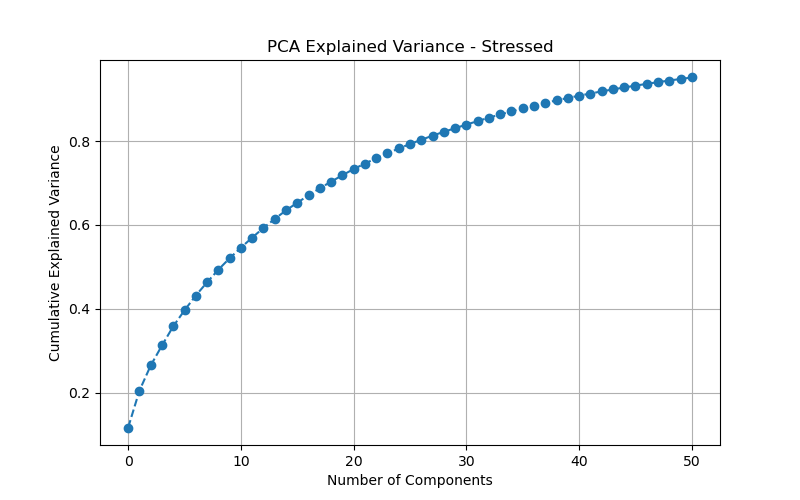 
  <strong><em>Figure 9: PCA Explained Variance for the Stressed Dataset</em></strong>

 

As shown in `Figure 9`, retaining 95% of the variance now requires only 51 principal components (compared to 131 in the Ideal dataset). This dramatic reduction suggests that linear PCA is likely capturing dominant, high-variance background noise rather than the nuanced structural details of the hands.

#### 5.2.2 Experimental Performance and Robustness Decay

  
**Model Performance Result (Stressed Dataset):**
*Training Samples: 78 | Test Samples: 17*

| Feature Extractor | Stressed Accuracy | Ideal Accuracy | Robustness Decay |
| :--- | :---: | :---: | :---: |
| **LDA** | **0.8824** | **1.0000** | **11.76%** |
| HOG + PCA | 0.8824 | 1.0000 | 11.76% |
| PCA | 0.7647 | 1.0000 | 23.53% |
| ISOMAP | 0.7647 | 1.0000 | 23.53% |
| UMAP | 0.5882 | 1.0000 | 41.18% |

**Discussion of Robustness Analysis:**
* **Vulnerability of Non-linear Manifolds:** Surprisingly, non-linear manifold learning (**ISOMAP**) performed identically to the linear **PCA** baseline (0.7647). **UMAP** suffered the most severe accuracy drop (41.18%). This suggests that in low-sample, high-noise environments, complex non-linear projections tend to overfit the background clutter, failing to capture the true underlying gesture manifold.
* **Stability of Gradient Features:** The **HOG + PCA** pipeline demonstrated high performance (0.8824). Because HOG relies on local gradient orientations rather than raw pixel intensities, it effectively isolates gesture geometry and ignores pixel-level background fluctuations.
* **Advantages of Supervised Learning:** **LDA** also tied for the highest accuracy (0.8824). By actively maximizing inter-class separability via class labels during the training phase, LDA successfully filtered out environmental stress that unsupervised methods completely failed to ignore.

  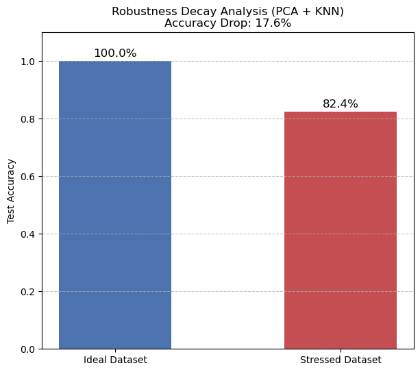 
  <strong><em>Figure 10: Robustness Decay Comparison (PCA + KNN)</em></strong>

 

**Conclusion for Model Selection:**
Although both LDA and HOG+PCA achieved identical accuracy (0.8824) and robustness decay (11.76%), **LDA** was selected as the optimal feature extractor for the interactive application in Module 3 due to its advantages as followed:
1. **Dimensionality:** LDA successfully compressed the data into just **5 dimensions** (number of classes - 1), whereas the HOG+PCA pipeline required **60 dimensions** to achieve the exact same accuracy. 
2. **Inference Latency:** For a real-time Rock-Paper-Scissors game, LDA requires only computationally lightweight matrix multiplications during inference. In contrast, HOG requires computationally expensive, sliding-window gradient calculations across the entire image. 

  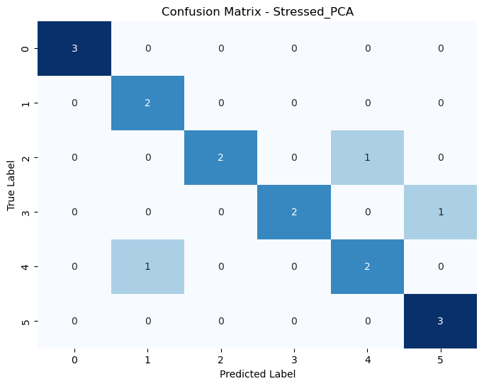 
  <strong><em>Figure 11: Confusion Matrix for Stressed Dataset (PCA)</em></strong>

 

### 5.3 Module 3: Rock-Paper-Scissors (Strategic Application)
**Objective:**
With LDA selected as the feature extraction method, this module compares KNN and SVM to determine which works better for the three-class Rock-Paper-Scissors (RPS) subset. The best model is then used in a live 10-round simulation.

**Classifier Comparison:**
Both KNN and SVM achieved very high accuracy on the RPS subset, with SVM slightly outperforming KNN (99.97% vs. 99.94%), as shown in the classifier comparison bar chart below. While the difference is small, SVM was chosen because it can create more flexible decision boundaries in the reduced 5-dimensional LDA space, where the classes are tightly clustered. Based on this, SVM was selected as the final model for deployment.

  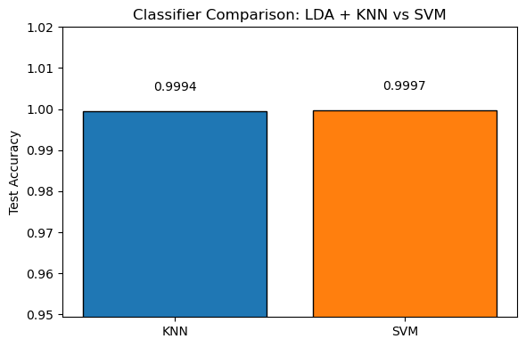 
  <em>Figure: RPS Classifier Accuracy Comparison: KNN vs SVM</em>

The KNN tuning curve shows that accuracy stayed at 100% for all K values from 1 to 30. This suggests the LDA feature space separates the three RPS classes almost perfectly. As a result, the choice of K has no practical impact on training performance for this subset, and K=5 is selected as a reasonable default.

  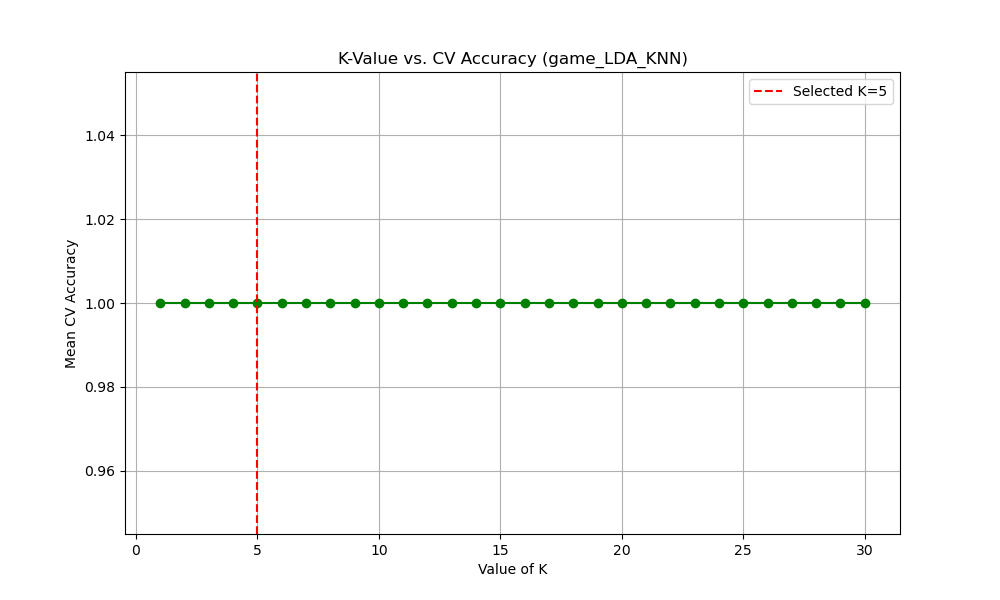 
  <em>Figure: KNN Tuning Curve - RPS Game Subset, LDA Features</em>

**Game Simulation Results:**
The deployed model was evaluated across a 10-round Rock-Paper-Scissors game simulation against a randomly sampling computer opponent. The outcome examples below shows one representative Win, Lose, and Tie scenario, confirming that the model correctly identifies gesture classes even under the compressed LDA feature representation. 

  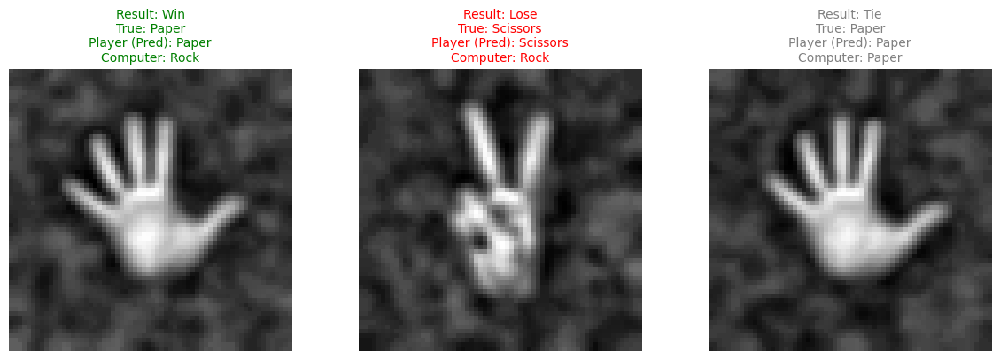 
  <em>Figure: RPS Game Outcome Examples (Win / Lose / Tie)</em>

---

## 6. Conclusion
This project developed a three-module pipeline for robust finger-counting gesture classification, progressively evaluating feature extraction strategies from ideal to stressed conditions and deploying the optimal model into a real-time Rock-Paper-Scissors application. We summarize our key findings below:

**Key Findings & Research Questions Addressed:**

* **1. Improvement of PCA+LDA over Standard PCA (Q1):** The cascaded PCA+LDA architecture drastically improved class separability in the feature space. While standard PCA suffered a 23.53% robustness decay under environmental stress, LDA successfully filtered out background noise by maximizing inter-class variance. This capped the decay at just 11.76% while simultaneously compressing the data into an ultra-efficient 5-dimensional space.

* **2. Hybrid Structural Descriptors vs. Pixel Projections (Q2):** The hybrid HOG+PCA approach demonstrated exceptional resilience, matching LDA's top accuracy (88.24%) and significantly outperforming standard PCA. By isolating local geometric shapes from global lighting variances, HOG proved highly robust. However, as an efficiency tie-breaker, the pixel-level PCA+LDA projection was ultimately preferred for deployment because it achieved the exact same accuracy using only 5 dimensions, compared to HOG's 60 dimensions.

* **3. Quantifying "Robustness Decay" (Q3):** Transitioning from monochrome to cluttered backgrounds induced significant performance drops across all models, proving that near-perfect accuracy under ideal conditions is highly misleading. We successfully quantified this "Robustness Decay," which ranged from an optimized 11.76% (LDA and HOG) to a severe 41.18% (UMAP), highlighting the absolute necessity of environmental stress-testing for computer vision models.

* **4. Vulnerability of Manifold Learning in Noise (Q4):** Contrary to our initial hypothesis, manifold learning methods did *not* handle complex backgrounds better than linear PCA. ISOMAP merely matched the standard PCA baseline, while UMAP suffered the highest decay (>40%). This confirms that in low-sample, noisy environments, non-linear algorithms are highly susceptible to overfitting background artifacts rather than capturing the true gesture topology.

* **5. Strategic Reliability on Game Subsets (Q5):** In module3, the LDA method successfully separated the gestures, allowing both KNN and SVM to achieve extremely high accuracy. We ultimately selected SVM (99.97% accuracy) over KNN because it creates more flexible boundaries to separate the classes. Finally, The successful 10-round live test proved that our system is highly reliable and efficient enough for real-time applications.

**Limitations and Future Work:** 
* **Dataset Constraints:** The limited sample size of the Stressed dataset restricted a definitive assessment of deep manifold learning. Future work should incorporate larger, more diverse noisy datasets to further stress-test non-linear architectures.
* **Live Feed Integration:** Transitioning the RPS simulation from static image inputs to a real-time webcam video feed would provide a more rigorous empirical evaluation of the model's inference latency and its robustness against dynamic lighting and motion blur.
---

## 7. References
1. Roy, K., & Akif, M. A. H. (2022, February). Real time hand gesture based user friendly human computer interaction system. In 2022 International Conference on Innovations in Science, Engineering and Technology (ICISET) (pp. 260-265). IEEE.
2. Oudah, M., Al-Naji, A., & Chahl, J. (2020). Hand gesture recognition based on computer vision: a review of techniques. journal of Imaging, 6(8), 73.
3. Zhang, D., Zhao, X., Han, J., & Zhao, Y. (2014). A comparative study on PCA and LDA based EMG pattern recognition for anthropomorphic robotic hand. 2014 IEEE International Conference on Robotics and Automation (ICRA), 4850-4855.
4. Lai, C. Q., & Teoh, S. S. (2016). An Efficient Method of HOG Feature Extraction Using Selective Histogram Bin and PCA Feature Reduction. Advances in Electrical and Computer Engineering, 16(4), 101-108.
5. Ahmed, F., Khan, W. A., Iqbal, M., Abazeed, A. R. A., Alrababah, H., & Khan, M. F. (2023). Rock-paper-scissors image classification using transfer learning. 2023 International Conference on Business Analytics for Technology and Security (ICBATS), 1-6.
6. Reza, A. M. (2004). Realization of the Contrast Limited Adaptive Histogram Equalization (CLAHE) for Real-Time Image Enhancement. Journal of VLSI Signal Processing Systems, 38, 35-44.
7. McInnes, L., Healy, J., & Melville, J. (2018). Umap: Uniform manifold approximation and projection for dimension reduction. arXiv preprint arXiv:1802.03426.
8. Tenenbaum, J. B., De Silva, V., & Langford, J. C. (2000). A global geometric framework for nonlinear dimensionality reduction. Science, 290(5500), 2319-2323.
